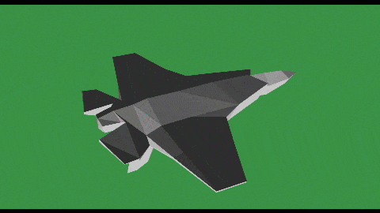

# CPU Based 3D Rendering
Adding the idea of directional light (like sun) and flat shading.

# How To Use
Press 1, 2, 3, 4, 5 to change render mode (shading mode), and press c, d to toggle backface culling.

## Demo


## Setup
Install [MinGW](https://www.mingw-w64.org/downloads/).
Run this followed commands:

``` bash
# Install SDL2 library
sudo apt install build-essential
sudo apt install libsdl2-dev

# Compiling the project on your computer
make

# Running the application
make run
```

# Soloution for Possible Errors
1. Windows users can use WSL.